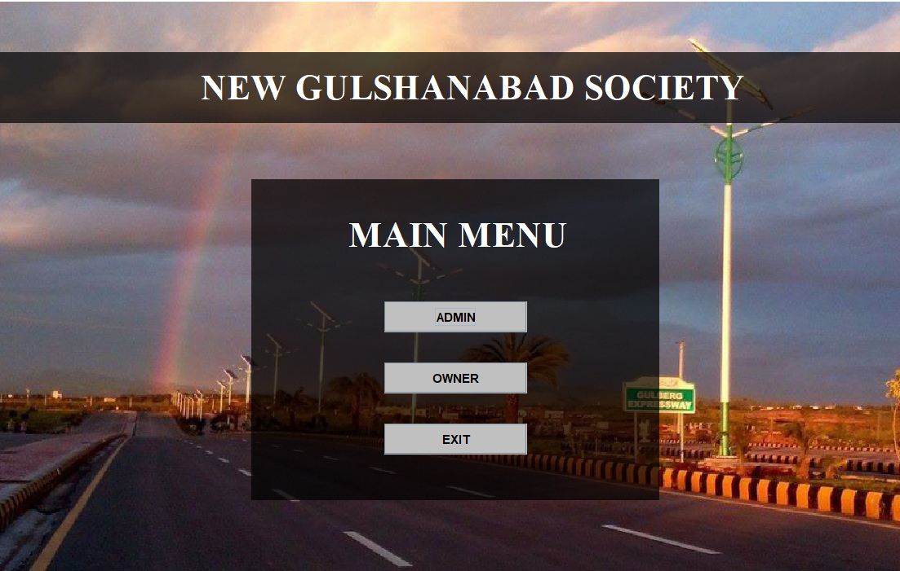
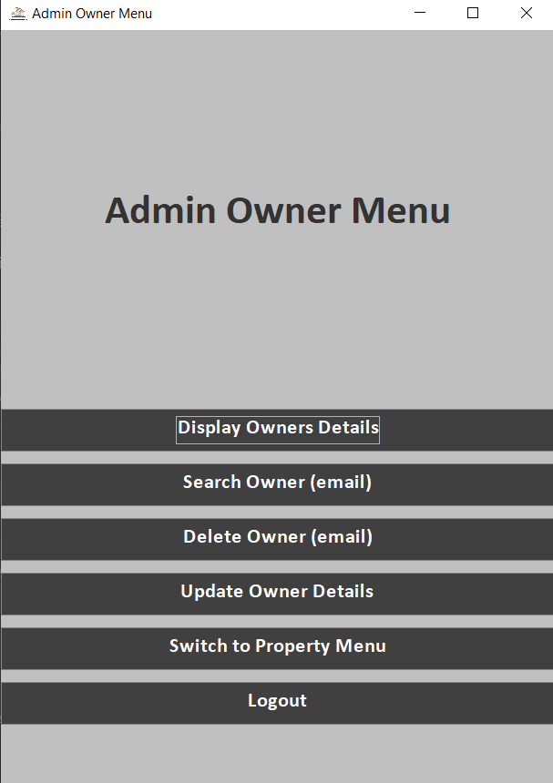
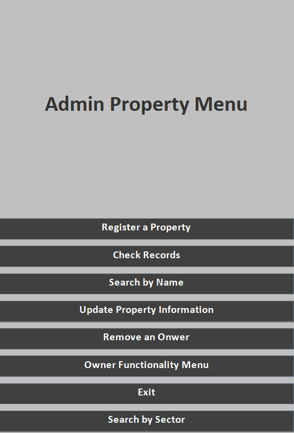
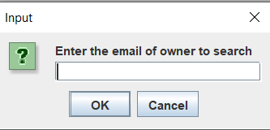
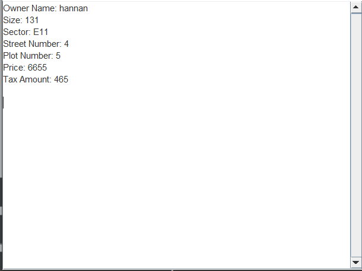
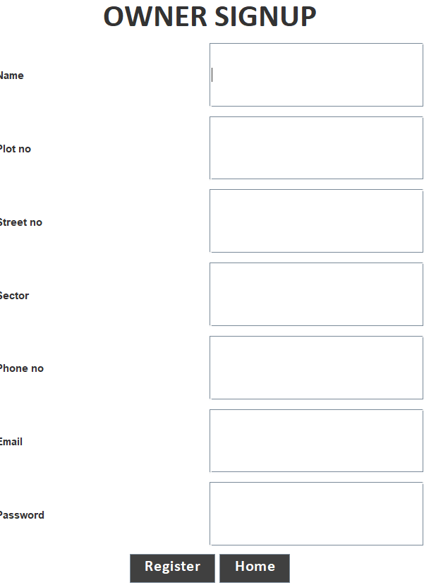
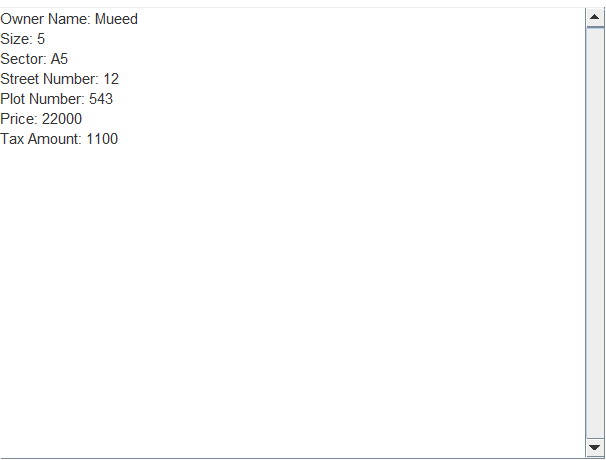

# Gulshanabad Society Management System
<p align="center">
  
</p>

# Table of Contents

- [Gulshanabad Society Management System](#gulshanabad-society-management-system)
  - [Description](#description)
    - [Login/Signup](#loginsignup)
    - [Admin Section](#admin-section)
      - [Admin Property Menu](#admin-property-menu)
      - [Admin Owner Menu](#admin-owner-menu)
    - [Member Section](#member-section)
  - [Villa and Flats](#villa-and-flats)
  - [Taxation](#taxation)
  - [File Operations](#file-operations)
  - [Installation Steps](#%EF%B8%8F-installation-steps)
  - [Screenshots](#screenshots)
    - [Main Menu](#main-menu)
    - [Admin Owner Dashboard](#admin-owner-dashboard)
    - [Admin Property Menu](#admin-property-menu)
    - [Example Input](#example-input)
    - [Flat Finder](#flat-finder)
    - [Login](#login)
    - [Signup](#signup)
    - [Villa Display](#villa-display)
  - [Contribution Guidelines](#-contribution-guidelines)
  - [Built with](#💻-built-with)

## Description
Welcome to **New Gulshanabad Society**, A Java-based OOP project for property management, offering a secure platform for users to buy and register plots or villas with distinct tax schemes. The system features admin functionalities like property registration and owner management, ensuring a seamless experience for society members.
### Login/Signup

Users can either log in with their existing credentials or sign up by providing the necessary details. Authentication is based on the user's email address.

### Admin Section

The Admin section is equipped with two menus: Admin Property Menu and Admin Owner Menu.

#### Admin Property Menu

- **Register Properties:** Allows the admin to register new properties.
- **Search and Update Properties:** Enables the admin to search for properties and make updates.
  
#### Admin Owner Menu

- **Removal of an Owner:** Provides the capability to remove an owner from the system.
- **Display and Update Owner Data:** Allows the admin to view and update owner information.

### Member Section

Members of the society can search for their own properties and retrieve relevant details.

## Villa and Flats

Each flat and villa comes with the following details:

- **Price**
- **Size**
- **Address**
- **Owner**

## Taxation

An interface named "Taxable" is implemented, assigning different tax values for each type of property.

## File Operations

All owner and admin accounts, as well as property details, are stored in files. The system supports basic file operations such as addition, deletion, updating, and displaying of data (both specific and all).

## 🛠️ Installation Steps:

- Clone the Repository

```
git clone https://github.com/Mohid-Anwar/Gulshanabad-Society-Management-System.git
cd Gulshanabad-Society-Management-System
```

And you're Ready to run Your code

# Screenshots


- *Main Menu*


- *Admin Owner Dashboard*


- *Admin Property Menu*


- *Example Input*


- *Flat Finder*


- *Login*


- *Signup*


- *Villa Display*


## 🍰 Contribution Guidelines:</h2>

Contributions are welcome! Fork the repository and submit a pull request.
  
## 💻 Built with

Technologies used in the project:

*   Java
*   VS Code
*   IntelliJ
